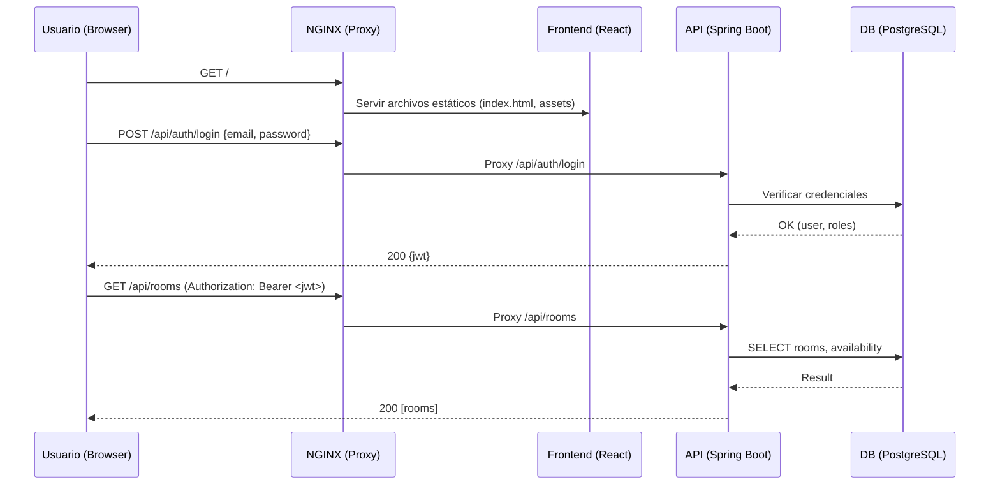

# Arquitectura del Proyecto: Plataforma de Reservas para Espacios de Coworking

Este documento describe la arquitectura técnica del sistema, los componentes, el flujo de datos y las decisiones clave. La solución se ejecuta en contenedores Docker y usa **NGINX como reverse proxy** para unificar el acceso al frontend y a la API.

---

## Stack Tecnológico

- **Frontend:** React + Vite + TailwindCSS
- **Backend:** Java 22 + Spring Boot (Web, Security, Validation, JPA/Hibernate)
- **Base de datos:** PostgreSQL 15
- **Proxy/Servidor web:** NGINX (reverse proxy + serving de estáticos)
- **Orquestación local:** Docker Compose
- **Autenticación:** JWT + Spring Security
- **Documentación API:** Swagger/OpenAPI
- **Correo:** JavaMail o SendGrid (según credenciales disponibles)

---

## Diagrama de Arquitectura (Mermaid)

```mermaid
flowchart LR
    Client[Cliente (Browser)] -->|HTTP/HTTPS| NGINX[(NGINX \n Reverse Proxy)]
    NGINX -->|/| FE[Frontend: React (estático)]
    NGINX -->|/api| BE[Backend: Spring Boot]
    BE -->|JPA/Hibernate| DB[(PostgreSQL)]

    subgraph Docker Network
      FE --- BE
      BE --- DB
      FE --- NGINX
      BE --- NGINX
      DB -. internal .- NGINX
    end
```

> **Notas:**
>
> - NGINX expone un **único endpoint público** (puerto 80/443).
> - Las rutas **`/`** sirven el **build estático** del frontend.
> - Las rutas **`/api`** se **proxyfían** hacia el backend Spring Boot.
> - La comunicación interna entre contenedores ocurre en la **misma red de Docker**.

---

## Diagrama de Flujo de Solicitudes (Mermaid)



---

## Contenedores y Puertos

> En desarrollo, puedes exponer backend y db para inspección. En producción, **solo NGINX** debe ser accesible públicamente.

---

## Seguridad y Autenticación

- **JWT** emitido por `/api/auth/login` y renovable según política.
- Rutas públicas: `/api/auth/**`, `/swagger-ui/**`, `/v3/api-docs/**` (ajustable).
- Rutas protegidas: resto de `/api/**` según **roles** (`USER`, `ADMIN`).
- Token en **HttpOnly Cookie** o Authorization header (Bearer). Recomendado: HttpOnly + SameSite=Lax/Strict.
- CORS gestionado en backend (permitiendo origen del dominio público servido por NGINX).

---

## Convenciones de API (resumen)

- Base de API: `/api/v1`
- Ejemplos de endpoints:
  - `POST /api/auth/login` — autentica y emite JWT
  - `POST /api/auth/register` — alta de usuario
  - `GET /api/rooms` — lista de salas
  - `POST /api/reservations` — crea reserva (valida disponibilidad)

**Códigos de estado**

- `200/201` OK/Creado, `400` Validación, `401` No autenticado, `403` No autorizado, `409` Conflicto reserva, `500` Error servidor.

---

## Testing & Observabilidad (visión)

- **Backend:** JUnit + Spring Test (controladores/servicios/repositorios)
- **Frontend:** React Testing Library para componentes críticos
- **Logs:** JSON logs desde backend (opcional), nivel INFO/ERROR
- **Salud:** Actuator (`/actuator/health`) opcional para monitoreo

---

## Estrategia de Despliegue (resumen)

- **Desarrollo:** `docker compose up --build` (exponer puertos para depurar si se requiere)
- **Staging/Producción:** Solo NGINX público; backend y db **sin puertos host**. Variables via `.env`/secrets.
- **CI/CD (posterior):** Build & test por repo; publicación de imágenes a registry; despliegue automatizado.

---

## Decisiones Técnicas Clave

1. **NGINX como reverse proxy** desde Sprint 1 para un único punto de entrada.
2. **Frontend estático servido por NGINX** (mejor rendimiento y simplicidad productiva).
3. **JWT** para autenticación sin estado.
4. **Un solo ****`docker-compose`** para desarrollo y perfil de producción con overrides.
5. **Separación de responsabilidades**: UI/API/DB aislados en contenedores.

---

